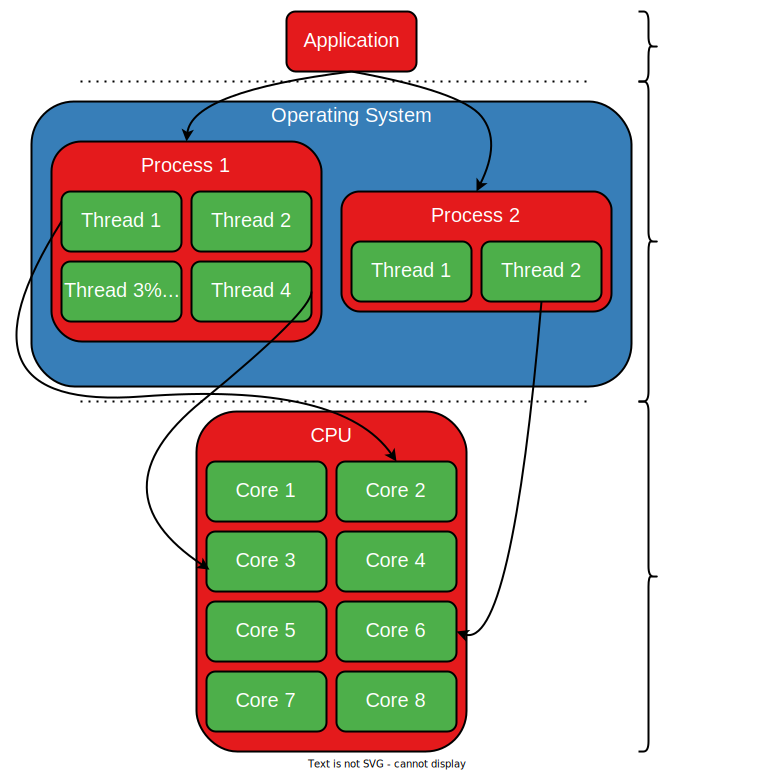
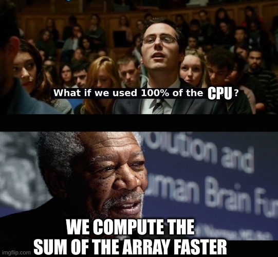
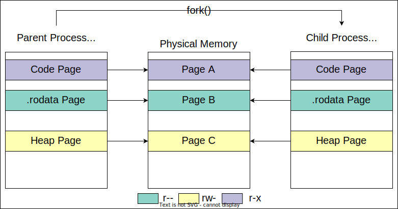
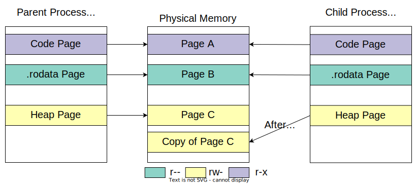

# Compute

The main criterion we use to rank CPUs is their _computation power_, i.e. their ability to crunch numbers and do math.
Numerous benchmarks exist out there and they are publicly displayed on websites such as [CPUBenchmark](https://www.cpubenchmark.net/).

This benchmark measures the performance of the computer's CPU in a variety of scenarios:
- its ability to perform integer operations
- its speed in floating point arithmetic
- data encryption and compression
- sorting algorithms and others

You can take a look at what exactly is measured using [this link](https://www.cpubenchmark.net/cpu.php?cpu=AMD+Ryzen+Threadripper+PRO+5995WX).
It displays the scores obrtained by a high-end CPU.
Apart from the tests above, other benchmarks can also focus on other performance metrics such as branch prediction or prefetching.

Other approaches are less artificial, measuring performance on real-world applications such as compile times and performance in the lastest (and most resource-demandign) video games.
The latter metric revolves around how many average FPS (frames per second) a given CPU is able to crank out in a specific video game.
[This article](https://www.gamersnexus.net/guides/3577-cpu-test-methodology-unveil-for-2020-compile-gaming-more) goes into more detail regarding the methodology of running CPU benchmarks on real-world applications.

Most benchmarks, unfortunately, are not open source, especially the more popular ones, such as [Geekbench 5](https://browser.geekbench.com/processor-benchmarks).
Despite this shortcoming, benchmarks are widely used to compare the performance of various computer **hardware**, CPUs included.

## The Role of the Operating System

As you've seen so far, the CPU provides the "muscle" requried for fast computation. i.e. the highly optimised hardware and multiple ALUs, FPUs
and cores necessary to perform those computations.
However, it is the **operating system** that provides the "brains" for this computation.
Specifically, modern CPUs have the capacity to run multiple tasks in parallel.
But they do not provide a means to decide which task to run at each moment.
The OS comes as an _orchestrator_ to **schedule** the way these tasks (that we will later call threads) are allowed to run and use the CPU's resources.
This way OS tells the CPU what code to run on each CPU core so that it reaches a good balance between high throughput (running many instructions) and fair access to CPU cores.

It is cumbersome for a user-level application to interact directly with the CPU.
The developer would have to write hardware-specific code which is not scalable and is difficult to maintain.
In addition, doing so would leave it up to the developer to isolate their application from the others that are present on the system.
This leaves applications vulnerable to countless bugs and exploits.

To guard apps from these pitfalls, the OS comes and mediates interactions between regular programs and the CPU by providing a set of **abstractions**.
These abstractions offer a safe, uniform and also isolated way to leverage the CPU's resources, i.e. its cores.
There are 2 main abstractions: **processes** and **threads**.



As we can see from the image above, an application can spawn one or more processes.
Each of these is handled and maintained by the OS.
Similarly, each process can spawn however many threads, which are also managed by the OS.
The OS decides when and on what CPU core to make each thread run.
This is in line with the general of interaction between an application and the hardware: it is always mediated by the OS.

## Processes

A process is simply a running program.
Let's take the `ls` command as a trivial example.
`ls` is a **program** on your system.
It has a binary file which you can find and inspect with the help of the `which` command:

```
student@os:~$ which ls
/usr/bin/ls

student@os:~$ file /usr/bin/ls
/usr/bin/ls: ELF 64-bit LSB pie executable, x86-64, version 1 (SYSV), dynamically linked, interpreter /lib64/ld-linux-x86-64.so.2, BuildID[sha1]=6e3da6f0bc36b6398b8651bbc2e08831a21a90da, for GNU/Linux 3.2.0, stripped
```

When you run it, the `ls` binary stored **on the disk** at `/usr/bin/ls` is read by another application called the **loader**.
The loader spawns a **process** by copying some of the contents `/usr/bin/ls` in memory (such as the `.text`, `.rodata` and `.data` sections).
Using `strace`, we can see the [`execve`](https://man7.org/linux/man-pages/man2/execve.2.html) system call:
```
student@os:~$ strace -s 100 ls -a  # -s 100 limits strings to 100 bytes instead of the default 32
execve("/usr/bin/ls", ["ls", "-a"], 0x7fffa7e0d008 /* 61 vars */) = 0
[...]
write(1, ".  ..  content\tCONTRIBUTING.md  COPYING.md  .git  .gitignore  README.md  REVIEWING.md\n", 86.  ..  content	CONTRIBUTING.md  COPYING.md  .git  .gitignore  README.md  REVIEWING.md
) = 86
close(1)                                = 0
close(2)                                = 0
exit_group(0)                           = ?
+++ exited with 0 +++
```
Look at its parameters:
- the path to the **program**: `/usr/bin/ls`
- the list of arguments: `"ls", "-a"`
- the enivronment variables: the rest of the syscall's arguments

`execve` invokes the loader to create the `ls` process.
All subsequent syscalls are performed by the newly spawned `ls` process.
We will get into more details regarding `execve` [towards the end of this lab](#TODO-section).

TODO - image: creation of a process - loader

## Sum of the Elements in an Array

Let's assume we only have one process on our system and that process knows how to add the numbers in an array.
It can use however many resources it wants since there is no other process to contest it.
It would probabily look like the code in `support/sum-array/d/sum_array_sequential.d`.
The program also measures the time spent computing the sum.
Let's compile and run it:

```
student@os:~/.../lab/support/sum-array/d/$

student@os:~$ ./sum_array_sequential
Array sum is: 49945994146
Time spent: 127 ms
```

You will most likely get a different sum (because the array is made up of random numbers) and a different time than the ones shown above.
This is perfectly fine.
Use these examples qualitatively, not quantitatively.

### Spreading the Work Among Other Processes

Due to how it's implemented so far, our program only uses one of our CPU's cores.
We never tell it to distribute its workload on other cores.
This is wasteful as the rest of our cores remain unused:

```
student@os:~$ lscpu | grep ^CPU\(s\):
CPU(s):                          8
```
We have 7 more cores waiting to add numbers in our array.



What if we use 7 more processes between which we spread the task of adding the numbers in this array?
If we split the array into several equal parts and designate a separate process to calculate the sum of each part, we should get a speedup because now the work performed by each individual process is reduced.

Let's take it methodically.
Compile and run `sum_array_processes.d` using 1, 2, 4 and 8 processes respectively.
Note the running times for each number of processes.
We expect the speedups compared to our reference run to be 1, 2, 4 and 8 respectively, right?

[Quiz](./quiz/processes-speedup.md)

You most likely did get some speedup, especially when using 8 processes.
Now we will try to improve this speedup by using **threads** instead.

#### Practice: Baby steps - Python

Run the code in `support/create-process/popen.py`.
It simply spawns a new process running the `ls` command using [`subprocess.Popen()`](https://docs.python.org/3/library/subprocess.html#subprocess.Popen).
Do not worry about the huge list of arguments that `Popen()` takes.
They are used for inter-process-communication.
You'll learn more about this in the [Application Interaction chapter](../../app-interact/).

Now change the command to anything you want.
Also give it some arguments.
From the outside, it's as if you were running these commands from the terminal.

#### Practice: High level - Python

Head over to `support/sleepy/sleepy_creator.py`.
Use `subprocess.Popen()` to spawn 10 `sleep 1000` processes.

1. Now use the same `pstree -pac` command and look for `sleepy_creator.py`.
It is a `python3` process, as this is the interpreter that runs the script, but we call it the `sleepy_creator.py` process for simplicity.
If you found it, you did something wrong.
It should be missing.
Now use `pstree -pac` and look for the `sleep` processes you have just created.

[Quiz](./quiz/parent-of-sleep-processes.md)

2. Change the code in `sleepy_creator.py` so that the `sleep 1000` processes are the children of `sleepy_creator.py`.
Kill the previously created `sleep` processes using `killall sleep`.
Verify that `sleepy_creator.py` remains the parent of the `sleep`s it creates using `pstree -pac`.

#### Practice: Lower level - C

Now let's see how to create a child process in C.
There are multiple ways of doing this.
For now, we'll start with a higher-level approach.

Go to `support/sleepy/sleepy_creator.c` and use [`system`](https://man7.org/linux/man-pages/man3/system.3.html) to create a `sleep 1000` process.

[Quiz](./quiz/create-sleepy-process-ending.md)

The `man` page also mentions that `system` calls `fork()` and `exec()` to run the command it's given.
If you want to find out more about them, head over to the [Arena and create your own mini-shell](#mini-shell).

#### Practice: Wait for Me!

Run the code in `support/wait-for-me/wait_for_me_processes.py`.
The parent process creates one child that writes and message to the given file.
Then the parent reads that message.
Simple enough, right?
But running the code raises a `FileNotFoundError`.
If you inspect the file you gave the script as an argument, it does contain a string.
What's going on?

[Quiz](./quiz/cause-of-file-not-found-error.md)

In order to solve race conditions, we need **synchronization**.
This is a mechanism similar to a set of traffic lights in a crossroads.
Just like traffic lights allow some cars to pass only after others have already passed, synchronization is a means for threads to communicate with each other and tell each other to access a resource or not.

The most basic form of synchronization is **waiting**.
Concretely, if the parent process **waits** for the child to end, we are sure the file is created and its contents are written.
Use `join()` to make the parent wait for its child before reading the file.

### Spreading the Work Among Other Threads

Compile the code in `sum_array_threads.d` and run it using 1, 2, 4 and 8 threads as you did before.
Each thread runs the `calculateArrayPartSum` function and then finishes.
Running times should be _slightly_ smaller than the implementation using processes.
This slight time difference is caused by process creation actions, which are costlier than thread creation actions.
Because a process needs a separate virtual address space (VAS) and needs to duplicate some internal structures such as the file descriptor table and page table, it takes the operating system more time to create it than to create a thread.
On the other hand, threads belonging to the same process share the same VAS and, implicitly, the same OS-internal structures.
Therefore, they are more lightweight than processes.

#### Practice: Wait for Me Once More!

Go to `support/wait-for-me/wait_for_me_threads.d`.
Spawn a thread that executes the `negateArray()` function.
For now, do not wait for it to finish; simply start it.

Compile the code and run the resulting executable several times.
See that the negative numbers appear from different indices.
This is precisely the nondeterminism that we talked about [in the previous section](#practice-wait-for-me).

Now wait for that thread to finish and see that all the printed numbers are consistently negative.

As you can see, waiting is a very coarse form of synchronization.
If we only use waiting, we can expect no speedup as a result of parallelism, because one thread must finish completely before another can continue.
We will discuss more fine-grained synchronization mechanisms [later in this lab](#synchronization).

Also, at this point, you might be wondering why this exercise is written in D, while [the same exercise, but with processes](#practice-wait-for-me) was written in Python.
There is a very good reason for this and has to do with how threads are synchronized by default in Python.
You can find out what this is about [in the Arena section](#the-gil), after you have completed the [Synchronization section](#synchronization).

#### Practice: `fork()`

Up to now we've been creating processes using various high-level APIs, such as `Popen()`, `Process()` and `system()`.
Yes, despite being a C function, as you've seen from its man page, `system()` itself calls 2 other functions: `fork()` to create a process and `execve()` to execute the given command.
As you already know from the [Software Stack](../../software-stack/) chapter, library functions may call one or more underlying system calls or other functions.
Now we will move one step lower on the call stack and call `fork()` ourselves.

`fork()` creates one child process that is _almost_ identical to its parent.
We say that `fork()` returns **twice**: once in the parent process and once more in the child process.
This means that after `fork()` returns, assuming no error has occurred, both the child and the parent resume execution from the same place: the instruction following the call to `fork()`.
What's different between the two processes is the value returned by `fork()`:
- **child process**: `fork()` returns 0
- **parent process**: `fork()` returns the PID of the child process (> 0)
- **on error**: `fork()` returns -1, only once, in the initial process

Therefore, the typical code for handling a `fork()` is available in `support/create-process/fork.c`.
Take a look at it and then run it.
Notice what each of the two processes prints:
- the PID of the child is also known by the parent
- the PPID of the child is the PID of the parent

Unlike `system()`, who also waits for its child, when using `fork()` we must do the waiting ourselves. 
In order to wait for a process to end, we use the [`waitpid()`](https://linux.die.net/man/2/waitpid) syscall.
It places the exit code of the child process in the `status` parameter.
This argument is actually a bitfield containing more information that merely the exit code.
To retrieve the exit code, we use the `WEXITSTATUS` macro.
You can view the rest of the information stored in the `status` bitfield [in the man page](https://linux.die.net/man/2/waitpid).

1. Change the return value of the child process so that the value displayed by the parent is changed.

2. Create a child process of the newly created child.
Use a similar logic and a similar set of prints to those in the support code.
Take a look at the printed PIDs.
Make sure the PPID of the "grandchild" is the PID of the child, whose PPID is, in turn, the PID of the parent.

### Threads vs Processes

So why use the implementation that spawns more processes if it's slower than the one using threads?

#### Safety

Compile and run the two programs in `support/sum-array-bugs/seg-fault/`, first with 2 processes and threads and then with 4.
They do the same thing as before: compute the sum the elements in an array, but with a twist: each of them contains a bug causing a seg fault.
Notice that `sum_array_threads` doesn't print anything with 4 threads, but merely a "Segmentation fault" message.
On the other hand, `sum_array_processes` prints a sum and a running time, albeit different from the sums we've seen so far.

The reason is that signals such as `SIGSEGV`, which is used when a segmentation fault happens affect the entire process that handles them.
Therefore, when we split our workload between several threads and one of them causes an error such as a seg fault, that error is going to terminate the entire process.
The same thing happens when we use processes instead of threads: one process causes an error, which gets it killed, but the other processes continue their work unhindered.
This is why we end up with a lower sum in the end: because one process died too early and didn't manage to write the partial sum it had computed to the `results` array.

#### Practice: Wait for It!

The process that spawns all the others and subsequently calls `waitpid` to wait for them to finish can also get their return codes.
Update the code in `support/sum-array-bugs/seg-fault/sum_array_processes.d` and modify the call to `waitpid` to obtain and investigate this return code.
Display an appropriate message if one of the child processes returns an error.

[Quiz](./quiz/seg-fault-exit-code.md)

So up to this point we've seen that one advantage of processes is that they offer better safety than threads.
Because they use separate virtual address spaces, sibling processes are better isolated than threads.
Thus, an application that uses processes can be more robust to errors than if it were using threads.

#### Memory Corruption

Because they share the same address space,  threads run the risk of corrupting each other's data.
Take a look at the code in `support/sum-array-bugs/memory-corruption/python/`.
The two programs only differ in how they spread their workload.
One uses threads while the other uses processes.

Run both programs.
The one using threads will most likely print a negative sum, while the other displays the correct sum.
This happens because all threads refer the same memory for the array `arr`.
What happens to the processes is a bit more complicated.
[Later in this lab](#copy-on-write) we will see that initially, the page tables of all processes point to the same physical frames or `arr`.
When the malicious process tries to corrupt this array by **writing data to it**, the OS duplicates the original frames of `arr` so that the malicious process writes the corrupted values to these new frames, while leaving the original ones untouched.
This mechanism is called **Copy-on-Write** and is an OS optimisation so that memory is shared between the parent and the child process, until one of them attempts to write to it.
At this point, this process receives its own separate copies of the previously shared frames.

Note that in order for the processes to share the `sums` dictionary, it is not created as a regular dictionary, but using the `Manager` module.
This module provides some special data structures that are allocated in **shared memory** so that all processes can access them.
You can learn more about shared memory and its various implementations [in the Arena section](#shared-memory).

### Conclusion

So far, you've probably seen that spawning a process can "use" a different program (hence the path in the args of `system` or `Popen`), but some languages such as Python allow you to spawn a process that executes a function from the same script.
A thread, however, can only start from a certain entry point **within the current address space**, as it is bound to the same process.
Concretely, a process is but a group of threads.
For this reason, when we talk about scheduling or synchronization, we talk about threads.
A thread is, thus, an abstraction of a task running on a CPU core.
A process is a logical group of such tasks.

We can sum up what we've learned so far by saying that processes are better used for separate, independent work, such as the different connections handled by a server.
Conversely, threads are better suited for replicated work: when the same task has to be performed on multiple cores.
However, replicated work can also be suited for processes.
Distributed applications, however, leverage different processes as this allows them to run on multiple physical machines at once.
This is required by the very large workloads such applications are commonly required to process.

Therefore, there is also a gray area where there is no clear right answer to this debate.
One such gray area are browsers.
Some open a new tab in a separate process, while others do it in a separate thread instead.
You can read more about how Firefox and Chrome use processes and threads on [this link](https://levelup.gitconnected.com/how-web-browsers-use-processes-and-threads-9f8f8fa23371).

## Browser Fight

Now we'll compare the two most popular browsers out there: Chrome and Firefox.

- TODO: Firefox vs Chrome
- Chrome: one process per tab.
Each process uses separate threads for: https://chromium.googlesource.com/chromium/src/+/master/docs/threading_and_tasks.md#Threads
Many processes open...
- Firefox: 4 processes from the start.
Each tab is a thread, but can also be a process when many tabs are opened...

## Copy-on-Write

So far you know that the parent and child process have separate virtual address spaces.
But how are they created, namely how are they "separated"?
And what about the **physical address space**?
Of course we would like the stack of the parent, for example, to be physically distinct from that of the child so they can execute different functions and use different local variables.

But should **all** the PAS of the parent be distinct from that of the child?
What about some read-only memory sections, such as `.text` and `.rodata`?
And what about the heap, where the child _may_ use some data previously written by the parent and then override it with its own data.

The answer to all of these questions is a core mechanism of multi-process operating systems called **Copy-on-Write**.
It works according to one very simple principle:
> The VAS of the child process initially points to the same PAS as that of the parent.
> A (physical) frame is only duplicated by the child when it attempts to **write** data to it.

This ensures that read-only sections remain shared, while writable sections are shared as long as their contents remain unchanged.
When changes happen, the process making the change receives a unique frame as a modified copy of the original frame _on demand_.

In the image below we have the state of the child and parent processes right after `fork()` returns in both of them.
See how each has its own VAS, both of them being mapped to (mostly) the same PAS.



When one process writes data to a writeable page (in our case, the child writes to a heap page), the frame to which it corresponds is first duplicated.
Then the process' page table points the page to the newly copied frame, as you can see in the image below.



**Be careful!**
Do not confuse copy-on-write with demand paging.
Remember from the [Data chapter](../../data/) that demand paging means that when you allocate memory the OS allocates virtual memory that remains unmapped to physical memory until it's used.
On the other hand, copy-on-write posits that the virtual memory is already mapped to some frames.
These frames are only duplicated when one of the processes attempts to write data to them.

#### Practice

Now let's see the copy-on-write mechanism in practice.
Keep in mind that `fork()` is a function used to create a process.

Open two terminals (or better: use [`tmux](https://github.com/tmux/tmux/wiki)).
In one of them compile and run the code in `support/fork-faults/fork_faults.c`.
After you press `Enter` in the first terminal window, run the following command in the second windwo:
```
student@os:~/.../lab/support/fork-faults$ ps -o min_flt,maj_flt $(pidof fork_faults)
```
It will show you the number of minor and major page faults performed by the `fork_faults` process and its child.

[Quiz 1](./quiz/parent-faults-before-fork.md)

Note that after `fork()`-ing, there is a second row in the output of `ps`.
That corresponds to the child process.
The first one still corresponds to the parent.

[Quiz 2](./quiz/child-faults-after-write.md)

Now it should be clear how demand paging differs from copy-on-write.
Shared memory is a similar concept.
It's a way of marking certain allocated pages so that copy-on-write is disabled.
As you may imagine, changes made by the parent to this memory are visible to the child and vice-versa.
You can learn more about it [its dedicated section in the Arena](#shared-memory).

## Scheduling

- cooperative: Unikraft.
- practice: add prints, start threads, with and without `yielding`

- D: TODO

## Synchronization

TODO

## Arena

### Threads and Processes: `clone`

Let's go back to our initial demos that used threads and processes.
We'll see that in order to create both threads and processes, the underlying Linux syscall is `clone`.
For this, we'll run both `sum_array_threads` and `sum_array_processes` under `strace`.
As we've already established, we're only interested in the `clone` syscall:
```
student@os:~/.../lab/support/sum-array/d/$ strace -e clone ./sum_array_threads 2
clone(child_stack=0x7f60b56482b0, flags=CLONE_VM|CLONE_FS|CLONE_FILES|CLONE_SIGHAND|CLONE_THREAD|CLONE_SYSVSEM|CLONE_SETTLS|CLONE_PARENT_SETTID|CLONE_CHILD_CLEARTID, parent_tid=[1819693], tls=0x7f60b5649640, child_tidptr=0x7f60b5649910) = 1819693
clone(child_stack=0x7f60b4e472b0, flags=CLONE_VM|CLONE_FS|CLONE_FILES|CLONE_SIGHAND|CLONE_THREAD|CLONE_SYSVSEM|CLONE_SETTLS|CLONE_PARENT_SETTID|CLONE_CHILD_CLEARTID, parent_tid=[1819694], tls=0x7f60b4e48640, child_tidptr=0x7f60b4e48910) = 1819694

student@os:~/.../lab/support/sum-array/d/$ strace -e clone ./sum_array_processes 2
clone(child_stack=NULL, flags=CLONE_CHILD_CLEARTID|CLONE_CHILD_SETTID|SIGCHLD, child_tidptr=0x7f7a4e346650) = 1820599
clone(child_stack=NULL, flags=CLONE_CHILD_CLEARTID|CLONE_CHILD_SETTID|SIGCHLD, child_tidptr=0x7f7a4e346650) = 1820600
```

We ran each program with an argument of 2, so we have 2 calls to `clone`.
Notice that in the case of threads, the `clone` syscall receives more arguments.
The relevant flags passed as arguments when creating threads are documented in [`clone`'s man page](https://man.archlinux.org/man/clone3.2.en):
- `CLONE_VM`: the child and the parent process share the same VAS
- `CLONE_{FS,FILES,SIGHAND}`: the new thread shares the filesystem information, file and signal handlers with the one that created it
The syscall also receives valid pointers to the new thread's stack and TLS, i.e. the only parts of the VAS that are distinct between threads (although they are technically accessible from all threads).

By contrast, when creating a new process, the arguments of the `clone` syscall are simpler (i.e. fewer flags are present).
Remember that in both cases `clone` creates a new **thread**.
When creating a process, `clone` creates this new thread within a new separate address space.

### Libraries for Parallel Processing

In `support/sum-array/d/sum_array_threads.d` we spawned threads "manually" by using the `spawn` function.
This is **not** a syscall, but a wrapper over the most common thread-management API in POSIX-based operating systems (such as Linux, FreeBSD, macOS): POSIX Threads or `pthreads`.
Using `ltrace`, we can see that `spawn` calls `pthread_create` in order to spawn the new thread.
In order to see what syscall `pthread_create` uses, check out [this section at the end of the lab](#threads-and-processes-clone).

Most programming languages provide a more advanced API for handling parallel computation.
D makes no exception.
Its standard library exposes the [`std.parallelism`](https://dlang.org/phobos/std_parallelism.html), which provides a series of parallel processing functions.
One such function is `reduce` which splits an array between a given number of threads and applies a given operation to these chunks.
In our case, the operation simply adds the elements to an accumulator: `a + b`.
Follow and run the code in `sum_array_threads_reduce.d`.

The number of threads is used within a [`TaskPool`](https://dlang.org/phobos/std_parallelism.html#.TaskPool).
This structure is a thread manager (not scheduler).
It silently creates the number of threads we request and then `reduce` spreads its workload between these threads.

Now run the `sum_array_threads_reduce` binary using 1, 2, 4, and 8 threads as before.
You'll see lower running times than `sum_array_threads` due to the highly-optimised code of the `reduce` function.
For this reason and because library functions are usually much better tested than your own code, it is always preferred to use a library function for a given task.

### Shared Memory

- TODO
- `mmap`
- high-level languages: D (`shared`), Python

### Mini-shell

#### Fist Step: `system` Dissected

You already know that `system` calls `fork()` and `execve()` to create the new process.
Let's see how and why.
First, we run the following command to trace the `execve()` syscalls used by `sleepy_creator`.
We'll leave `fork()` for later.
```
student@os:~/.../support/sleepy$ strace -e execve -ff -o syscalls ./sleepy_creator
```

At this point you will get two files whose names start with `syscalls`, followed by some numbers.
Those numbers are the PIDs of the parent and the child process.
Therefore, the file with the higher number contains logs of the `execve` and `clone` syscalls issued by the parent process, while
the other logs those two syscalls when made by the child process.
Let's take a look at them.
The numbers below will differ from those on your system:
```
student@os:~/.../support/sleepy:$ cat syscalls.2523393  # syscalls from parent process
execve("sleepy_creator", ["sleepy_creator"], 0x7ffd2c157758 /* 39 vars */) = 0
--- SIGCHLD {si_signo=SIGCHLD, si_code=CLD_EXITED, si_pid=2523394, si_uid=1052093, si_status=0, si_utime=0, si_stime=0} ---
+++ exited with 0 +++

student@os:~/.../support/sleepy:$ cat syscalls.2523394  # syscalls from child process
execve("/bin/sh", ["sh", "-c", "sleep 10"], 0x7ffd36253be8 /* 39 vars */) = 0
execve("/usr/bin/sleep", ["sleep", "10"], 0x560f41659d40 /* 38 vars */) = 0
+++ exited with 0 +++
```

[Quiz](./quiz/who-calls-execve-parent.md)

Now notice that the child process doesn't simply call `execve("/usr/bin/sleep" ...)`.
It first changes its virtual address space (VAS) to that of a `bash` process (`execve("/bin/sh" ...)`) and then that `bash` process switches its VAS to `sleep`.
Therefore, calling `system(<some_command>)` is equivalent to running `<some_command>` in the command line.

- TODO: so now we know that `bash` calls execve.
Let's implement a minishell.
The skeleton is in `TODO`.
Use `execve` to launch the command.

- quiz: what is the problem?
- solution: add `fork`

- TODO: moral of the story = fork + exec + wait + exit

#### TODO: Another language

- process executor in another language

### The GIL

- TODO
